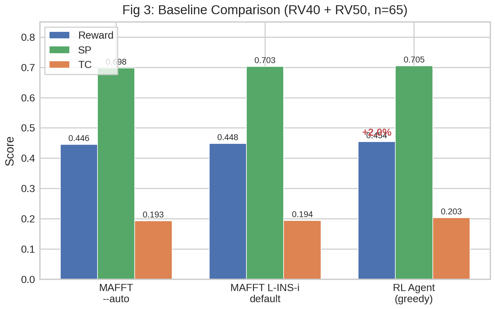
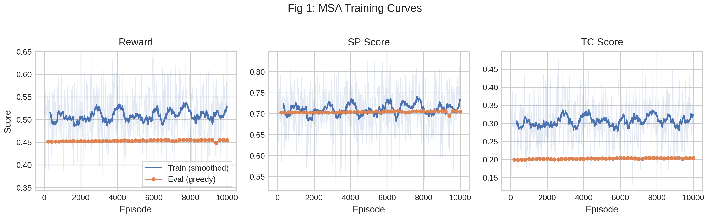
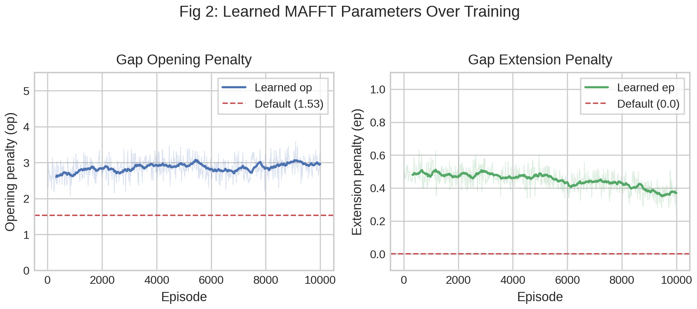
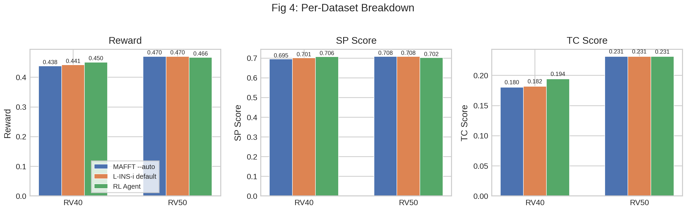

# RL-Learned Continuous Gap Penalties for Multiple Sequence Alignment

## Overview

We trained a reinforcement learning agent to predict alignment-specific gap
penalties for MAFFT, a widely-used multiple sequence alignment tool. The agent
observes features of the input sequences and predicts two continuous parameters
— the gap opening penalty (op) and gap extension penalty (ep) — that are
tailored to each alignment case. This represents a novel approach: no existing
MSA tool adapts gap penalties based on input sequence characteristics.

## Motivation

An exhaustive oracle analysis (see `results/oracle_analysis/ANALYSIS.md`)
established that:

- MAFFT parameter tuning accounts for **85% of total oracle headroom** over
  the best fixed configuration
- **35 unique best configurations** appear across 42 evaluation cases — no
  single parameter setting is universally optimal
- Cross-tool selection (MUSCLE, Clustal Omega) adds only 15% of headroom

These findings motivated a MAFFT-focused continuous policy that predicts
case-specific op and ep values.


## Experimental Setup

**Agent architecture.** Gaussian continuous policy with a 2-layer MLP
(20 → 128 → 128 → 2) producing mean op and ep predictions. Actions are
sampled from a Gaussian in unbounded space and transformed through sigmoid
into bounded ranges. A shared trunk feeds both the policy head and a value
baseline head.

| Parameter | Value |
|-----------|-------|
| Input features | 20-dim (lengths, composition, complexity, similarity) |
| Action space | 2 continuous: op ∈ [0.5, 5.0], ep ∈ [0.0, 1.0] |
| MAFFT algorithm | `--localpair --maxiterate 10` (L-INS-i) |
| Policy | Gaussian with learned log-std, sigmoid transform |
| Training | REINFORCE with value baseline, advantage normalization |
| Entropy coefficient | 0.01 |
| Learning rate | 3 × 10⁻⁴ (Adam) |
| Batch size | 16 |
| Episodes | 10,000 |
| Eval frequency | Every 200 episodes |

**Dataset.** BAliBASE 3.0 benchmark.

| Split | Reference Sets | Cases |
|-------|---------------|-------|
| Train | RV11, RV12, RV20, RV30 | 153 |
| Eval  | RV40, RV50 | 65 |

**Reward.** Scored against BAliBASE reference alignments:
`reward = 0.5 × SP + 0.5 × TC`, where SP is the sum-of-pairs score and TC
is the total column score.

**Baselines.**

1. **MAFFT --auto**: Default MAFFT with automatic algorithm selection
   (op=1.53, ep=0.0, algorithm chosen by MAFFT heuristic)
2. **MAFFT L-INS-i default**: Same algorithm as the agent (--localpair
   --maxiterate 10) with default parameters (op=1.53, ep=0.0)


## Results

### Baseline Comparison

**Table 1: Performance on evaluation set (RV40 + RV50, n=65)**

| Method | Reward | SP | TC |
|--------|:------:|:--:|:--:|
| MAFFT --auto | 0.4455 | 0.6981 | 0.1929 |
| MAFFT L-INS-i default | 0.4483 | 0.7025 | 0.1941 |
| **RL Agent (greedy)** | **0.4543** | **0.7053** | **0.2033** |

The RL agent outperforms both baselines:

- **+2.0% reward** over MAFFT --auto (+0.9% SP, +5.4% TC)
- **+1.3% reward** over L-INS-i default (+0.4% SP, +4.7% TC)

The largest relative gain is in TC score (+5.4%), the stricter metric that
requires entire alignment columns to match exactly.



**Fig 3.** Bar chart comparing reward, SP, and TC scores across the three
methods. The RL agent achieves the highest scores on all metrics.


### Training Dynamics

Training proceeded for 10,000 episodes (~30 hours wall-clock on CPU under
heavy system load). Training reward fluctuated around 0.51 with eval reward
steadily increasing from 0.451 to 0.454.



**Fig 1.** Training curves for reward, SP, and TC over 10K episodes.
Blue: training batches (smoothed with 20-batch moving average); orange:
greedy evaluation on RV40+RV50. The gap between training and evaluation
reflects the greater difficulty of the held-out reference sets.


### Learned Parameters

The agent learned gap penalties substantially different from MAFFT defaults:

| Parameter | MAFFT Default | RL Agent (mean) | Change |
|-----------|:------------:|:---------------:|:------:|
| Opening penalty (op) | 1.53 | ~3.0 | +96% |
| Extension penalty (ep) | 0.00 | ~0.4 | — |

The agent converged to op ≈ 3.0 (nearly 2× the default) and ep ≈ 0.4
(versus the default of 0.0). Both parameters stabilized by ~2,000 episodes.



**Fig 2.** Evolution of learned op (left) and ep (right) over training.
Dashed red lines show MAFFT defaults. The agent consistently prefers
higher opening penalties and nonzero extension penalties.


### Per-Dataset Breakdown

**Table 2: Per-dataset performance**

| Dataset | Method | Reward | SP | TC |
|---------|--------|:------:|:--:|:--:|
| **RV40** (n=49) | MAFFT --auto | 0.438 | 0.695 | 0.180 |
| | L-INS-i default | 0.441 | 0.701 | 0.182 |
| | RL Agent | **0.450** | **0.707** | **0.194** |
| **RV50** (n=16) | MAFFT --auto | 0.470 | 0.708 | 0.231 |
| | L-INS-i default | 0.470 | 0.708 | 0.231 |
| | RL Agent | 0.466 | 0.702 | 0.231 |

The agent's gains come primarily from **RV40** (+2.9% reward, +7.8% TC over
--auto). RV40 contains sequences with N/C-terminal extensions, where gap
penalty tuning has the most impact. On RV50 (internal insertions), all methods
perform similarly.



**Fig 4.** Per-dataset comparison across all three metrics. The RL agent's
advantage is concentrated on RV40.


## Discussion

### What the agent learned

The agent discovered that MAFFT's default gap penalties (op=1.53, ep=0.0) are
suboptimal for BAliBASE evaluation sets. Specifically:

- **Higher opening penalty** (op ≈ 3.0 vs 1.53): Discourages spurious gap
  openings, particularly important for the terminal extension cases in RV40
- **Nonzero extension penalty** (ep ≈ 0.4 vs 0.0): Penalizes long indels,
  which improves column-level accuracy (TC score)

### Novelty

This approach is distinct from prior work:

- **vs RL-based aligners** (DPAMSA, RLALIGN, DQNAlign): These replace the
  aligner with an RL agent that makes gap decisions step-by-step. Our approach
  wraps an existing production aligner and only tunes its parameters.
- **vs Parameter Advisors** (DeBlasio & Kececioglu, 2017): Their Facet system
  selects from a discrete set of pre-computed parameters using accuracy
  estimation. Our agent predicts continuous parameters via policy gradient,
  enabling finer-grained adaptation.
- **vs standard MSA tools**: No existing aligner (MAFFT, MUSCLE, Clustal Omega)
  adapts gap penalties based on input sequence characteristics. The `--auto`
  flag in MAFFT selects the alignment algorithm but not the gap parameters.

### Limitations

1. **Modest gains**: The 2.0% improvement, while consistent, is small in
   absolute terms. The oracle analysis showed limited headroom from parameter
   tuning alone.
2. **Global parameters**: The agent predicts a single (op, ep) pair per
   alignment. Position-specific gap penalties could unlock further gains.
3. **Small evaluation set**: 65 cases from two BAliBASE reference sets.
   Broader benchmarking (OXBench, HOMSTRAD, SABmark) would strengthen claims.
4. **Fixed algorithm**: We fixed MAFFT to L-INS-i (--localpair --maxiterate 10).
   Joint algorithm and parameter selection could yield additional improvements.

### Practical application

The trained agent can serve as a drop-in wrapper around MAFFT:

```bash
# Instead of:  mafft --localpair --maxiterate 10 input.fasta
# Run:         rlalign input.fasta
```

The overhead is negligible (feature extraction + MLP forward pass takes
microseconds). MAFFT performs the actual alignment; the agent only selects
better parameters.


## Reproduction

```bash
# Train from scratch (requires BAliBASE 3.0 data)
CUDA_VISIBLE_DEVICES="" python main.py msa-train --episodes 10000

# Evaluate trained agent against baselines
CUDA_VISIBLE_DEVICES="" python main.py msa-evaluate

# Regenerate figures
python results/msa_continuous/generate_figures.py
```


## Files

| File | Description |
|------|-------------|
| `fig1_training_curves.{png,pdf}` | Training and eval curves over 10K episodes |
| `fig2_parameter_trajectory.{png,pdf}` | Learned op/ep values over training |
| `fig3_baseline_comparison.{png,pdf}` | RL agent vs MAFFT baselines |
| `fig4_per_dataset.{png,pdf}` | Per-dataset (RV40, RV50) breakdown |
| `generate_figures.py` | Script to regenerate all figures from logs |
| `workflow_diagram.py` | Script to generate the experimental workflow diagram |
