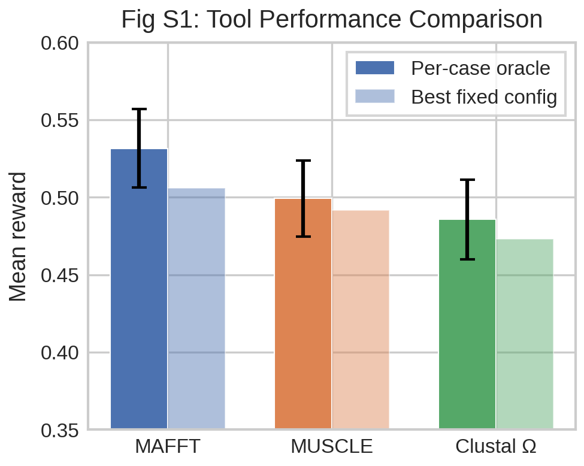
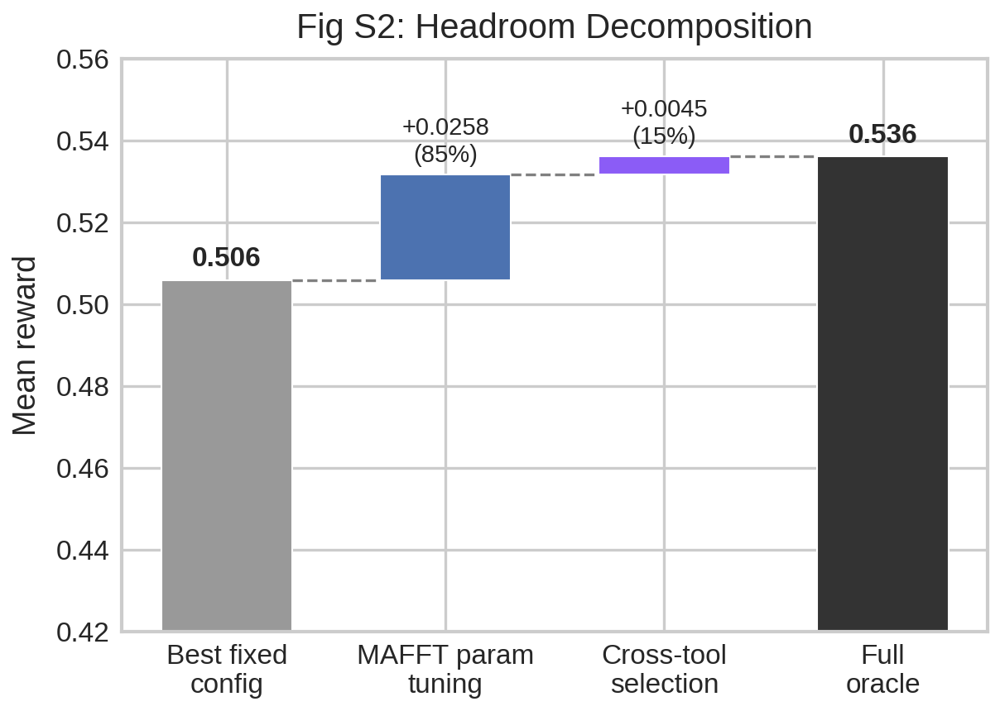
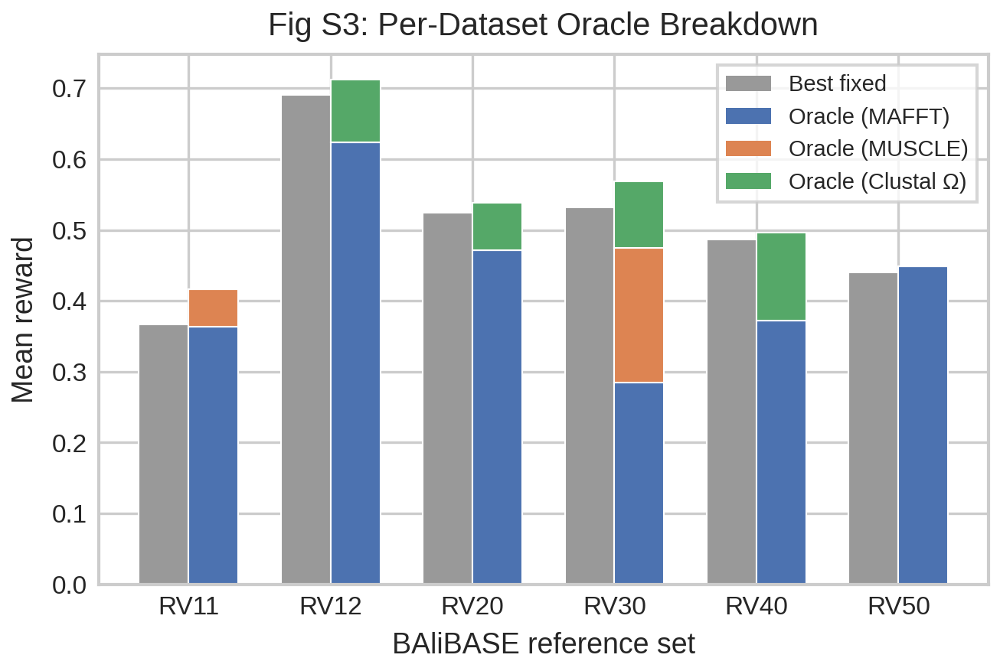
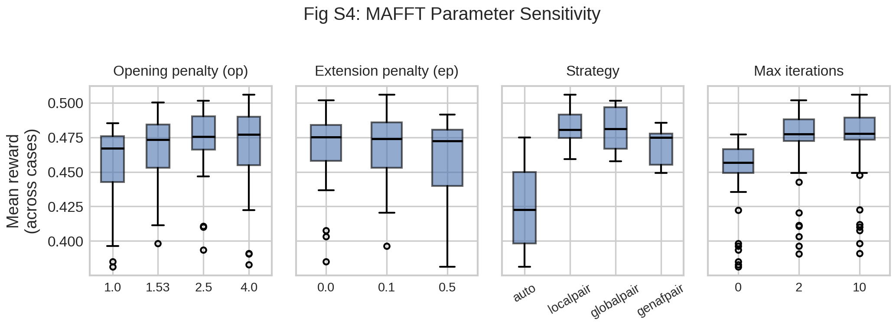
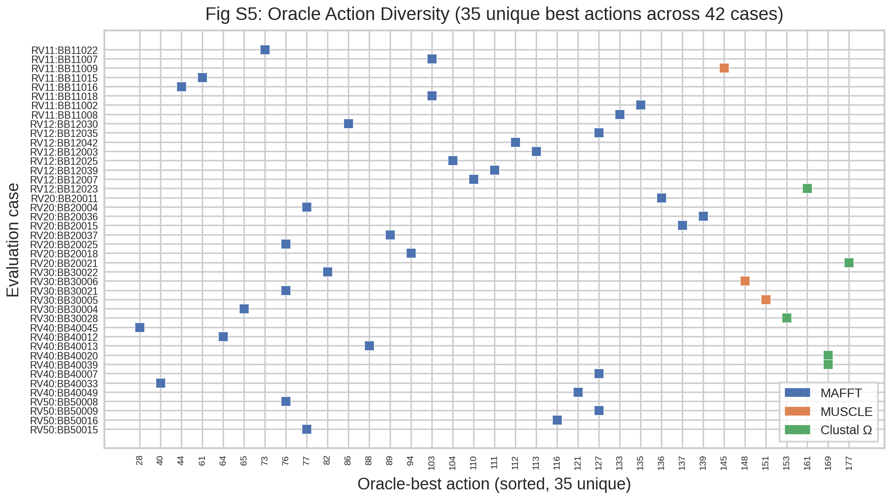
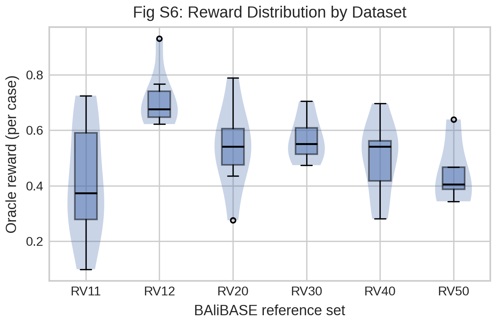

# Supplementary Material: Oracle Analysis of MSA Tool Configurations

## S1. Oracle Analysis Setup

We performed an exhaustive oracle analysis to characterize the performance landscape
of multiple sequence alignment (MSA) tool configurations on the BAliBASE 3.0 benchmark.

**Dataset.** We evaluated 42 cases from BAliBASE, stratified across six reference sets
(RV11, RV12, RV20, RV30, RV40, RV50) with up to 8 cases per set.

**Action space.** We defined 185 discrete tool configurations spanning three alignment tools:

| Tool | Parameters | Configs |
|------|-----------|---------|
| MAFFT 7.525 | op &isin; {1.0, 1.53, 2.5, 4.0} &times; ep &isin; {0.0, 0.1, 0.5} &times; strategy &isin; {auto, localpair, globalpair, genafpair} &times; maxiterate &isin; {0, 2, 10} | 144 |
| MUSCLE 5.3 | command &isin; {align} &times; perm &isin; {none, abc, bca} &times; perturb &isin; {0, 1, 3} | 9 |
| Clustal Omega 1.2.4 | iter &isin; {0, 1, 3, 5} &times; full &isin; {F, T} &times; full-iter &isin; {F, T} &times; kimura &isin; {F, T} | 32 |
| **Total** | | **185** |

**Reward.** Each alignment was scored against BAliBASE reference alignments using the
sum-of-pairs (SP) and total column (TC) scores. The reward is defined as
`r = 0.5 * SP + 0.5 * TC`.

**Exhaustive evaluation.** Every configuration was run on every case (42 &times; 185 = 7,770
total alignments), enabling exact computation of per-case oracle and best-fixed-config
baselines.

## S2. Per-Tool Performance

Table S1 shows per-tool oracle (best config per case within each tool) and
best-fixed-config (single config with highest mean reward) performance.

**Table S1: Per-Tool Oracle and Best-Fixed Performance**

| Tool | Per-case oracle | Best fixed config | Oracle &minus; Fixed |
|------|:--------------:|:-----------------:|:-------------------:|
| MAFFT | 0.5316 | 0.5058 | +0.0258 |
| MUSCLE | 0.4993 | 0.4918 | +0.0075 |
| Clustal &Omega; | 0.4857 | 0.4730 | +0.0127 |

MAFFT achieves the highest oracle reward (0.532) and the highest best-fixed reward
(0.506). It is the oracle-best tool on 34 of 42 cases (81%).

**Fig S1.** Per-tool oracle reward (solid) and best-fixed-config reward (faded),
with standard error bars on the oracle. MAFFT dominates both metrics.

## S3. Headroom Decomposition

The total oracle headroom (oracle minus best fixed config) is +0.0303. We decompose
this into two sources:

**Table S2: Headroom Decomposition**

| Component | Reward | Gain | % of headroom |
|-----------|:------:|:----:|:-------------:|
| Best fixed config (MAFFT, action 125) | 0.5058 | &mdash; | &mdash; |
| + MAFFT per-case param tuning | 0.5316 | +0.0258 | 85.2% |
| + Cross-tool selection | 0.5361 | +0.0045 | 14.8% |
| **Full oracle** | **0.5361** | **+0.0303** | **100%** |

MAFFT parameter tuning accounts for 85% of the total oracle headroom. Cross-tool
selection (switching to MUSCLE or Clustal Omega when they outperform all MAFFT configs)
contributes only 15%.

**Fig S2.** Waterfall chart decomposing the oracle headroom. The dominant gain comes
from per-case MAFFT parameter tuning, not from cross-tool selection.

## S4. Per-Dataset Results

Performance varies across BAliBASE reference sets. RV12 (families with >25%
identity) is easiest; RV11 (distant sequences) and RV50 (internal insertions) are
hardest.

**Table S3: Per-Dataset Oracle Analysis**

| Dataset | N | MAFFT oracle | MUSCLE oracle | ClustalO oracle | Full oracle | Best fixed | Headroom |
|---------|:-:|:------------:|:-------------:|:---------------:|:-----------:|:----------:|:--------:|
| RV11 | 8 | 0.4105 | 0.3617 | 0.2973 | 0.4160 | 0.3668 | +0.0492 |
| RV12 | 8 | 0.7117 | 0.6629 | 0.6447 | 0.7124 | 0.6904 | +0.0220 |
| RV20 | 8 | 0.5371 | 0.5040 | 0.5208 | 0.5384 | 0.5241 | +0.0143 |
| RV30 | 6 | 0.5493 | 0.5390 | 0.5359 | 0.5689 | 0.5317 | +0.0372 |
| RV40 | 8 | 0.4956 | 0.4751 | 0.4784 | 0.4968 | 0.4864 | +0.0104 |
| RV50 | 4 | 0.4482 | 0.4263 | 0.4135 | 0.4482 | 0.4398 | +0.0084 |

RV11 and RV30 show the largest headroom, suggesting these difficult cases benefit
most from adaptive parameter selection. RV12 has the highest absolute scores but
relatively modest headroom.

**Fig S3.** Per-dataset oracle (colored by tool distribution) vs best-fixed config
(gray). MAFFT dominates in most datasets, with MUSCLE and Clustal Omega occasionally
contributing on RV30 and RV40.

## S5. MAFFT Parameter Sensitivity

Since MAFFT parameter tuning accounts for 85% of oracle headroom, we examine which
MAFFT parameters matter most.

**Fig S4.** Mean reward (across all 42 cases) for each MAFFT parameter value,
marginalized over the other three parameter dimensions. The strategy dimension
(auto, localpair, globalpair, genafpair) and the opening penalty (op) show the
largest spread, indicating they are the most influential parameters. Extension
penalty (ep) and max iterations show more modest effects.

## S6. Action Diversity

Across 42 evaluation cases, we observe 35 unique oracle-best actions. No single
configuration is universally optimal.

**Table S4: Oracle Tool Distribution**

| Tool | Cases where oracle-best | Fraction |
|------|:----------------------:|:--------:|
| MAFFT | 34 | 81% |
| MUSCLE | 3 | 7% |
| Clustal &Omega; | 5 | 12% |

**Fig S5.** Each dot indicates the oracle-best action for a given evaluation case.
35 unique actions appear across 42 cases, with no dominant single configuration.
This diversity motivates a learned policy that adapts to input sequence characteristics.

**Fig S6.** Distribution of per-case oracle rewards, grouped by BAliBASE reference
set. RV12 cases achieve the highest rewards while RV11 has the most variance and
lowest median.

## S7. Conclusion

The oracle analysis reveals three key findings:

1. **MAFFT dominates.** MAFFT is the oracle-best tool on 81% of cases and achieves
   the highest oracle reward (0.532) and best-fixed reward (0.506).

2. **Parameter tuning is the main opportunity.** 85% of the total oracle headroom
   comes from per-case MAFFT parameter adaptation, not cross-tool selection.

3. **No universal best config.** 35 unique oracle-best actions across 42 cases
   demonstrate that adaptive parameter selection can improve over any fixed configuration.

These findings motivate a reinforcement learning approach focused on MAFFT parameter
selection conditioned on input sequence features.
